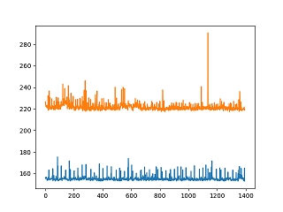
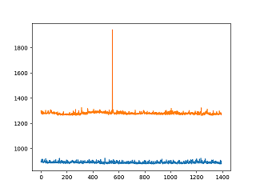

# intel-openvino-people-counter

## Model Selection 
Models were selected from the [Tensorflow Object Detection Model Zoo](https://github.com/tensorflow/models/blob/master/research/object_detection/g3doc/detection_model_zoo.md). The following two model were tried:

* ssd_inception_v2_coco
* faster_rcnn_inception_v2_coco

The SSD model had good latency (~155 microseconds per frame), but lacked accuracy and failed to detect some people in the video.
Faster-RCNN had bigger latency (~889 microseconds per frame), but provided good accuracy for this project. Stably detecting a person in the frame when he/she was there and not detecting when he/she is not there, is important for counting duration and person enter/exit.

## Model Optimization
The following three laters were unsupported by the core Model Optimizer:
* Layer proposals is not supported
* Layer Squeeze_3 is not supported
* Layer detection_output is not supported

But with the use of OpenVINO's faster_rcnn_support extension, all layers were supported, and the TF Model was successfully converted in IR format by the Model Optimizer. The following command was used:

```sh
python /opt/intel/openvino/deployment_tools/model_optimizer/mo.py --input_model faster_rcnn_inception_v2_coco_2018_01_28/frozen_inference_graph.pb --tensorflow_object_detection_api_pipeline_config faster_rcnn_inception_v2_coco_2018_01_28/pipeline.config --reverse_input_channels --tensorflow_use_custom_operations_config /opt/intel/openvino/deployment_tools/model_optimizer/extensions/front/tf/faster_rcnn_support.json
```

## Running without OpenVINO™ Toolkit
Both models performance was measured for inference latency (per frame), memory utilization during inference. 

| Model/Framework                             | Latency (microseconds)            | Memory (Mb) |
| -----------------------------------         |:---------------------------------:| -------:|
| ssd_inception_v2_coco (plain TF)            | 222                               | 538    |
| ssd_inception_v2_coco (OpenVINO)            | 155                               | 329    |
| faster_rcnn_inception_v2_coco (plain TF)    | 1280                              | 562    |
| faster_rcnn_inception_v2_coco (OpenVINO)    | 889                               | 281    |

Memory usage was measured with `free -m` (and then subtracting the value when no inference is running). Latencies were collected and averages calculated after video processing. Below are comparative latency graphs:




OpenVINO optimized networks produced bounding boxes undistiguishable for the human eye from those inferred with pure Tensorflow, with all people correctly identified in the video. So, in this particular case the significant latency (1.44 times) and memory (up to 2 times) gains at almost no cost are well worth it.

Run the pre-trained model without the use of the OpenVINO™ Toolkit. Compare the performance of the model with and without the use of the toolkit (size, speed, CPU overhead). What about differences in network needs and costs of using cloud services as opposed to at the edge?


## Potential Use Cases
* Retail Applications - count number of customers/visitors in the shop, the duration of their stay and locations they spent most time at. 
    * For those that stayed longer, analyzing locations thay spent most their time at, can give hints to what products make people stay (people like them and/or want to know more about them)
    * Check how often they come to the consultant to see how many consultant/employees should be in the shop at different times of the day. Can lead to better employees' schedules, part-time etc
    * Analyze traffic of shoppers to know when more items should be in stock

As seen with SSD and Faster-RCNN Models, it is important to use model that produces good accuracy, because if the model switches many times from detecting/undetecting a person while he/she is still there, or confuses other objects with people, will lead to very inaccurate results and therefore, bad business decisions. Therefore model should be tested well and correct detection threshold should be selected.

And, of course, lighting and camera resolution is important to get good quality of frames to infer from. Too low resolution, poor lighting will make it more difficult for a model to detect objects. If lighting or camera quality cannot be improved, one should consider transfer learning to re-train the model on the images with the particular resolution and lighting that is going to be used in production.

